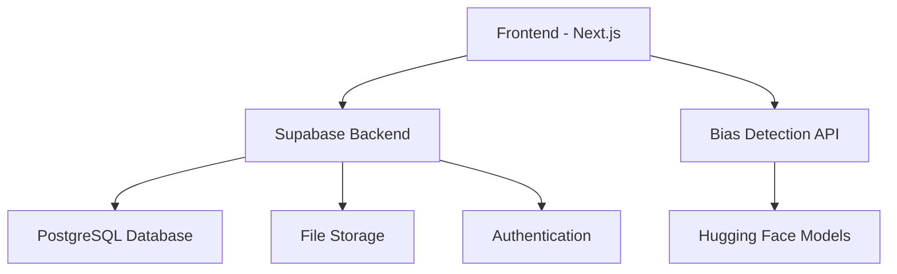

# 🏆 BiasBounty - AI Bias Detection Platform

<div align="center">


**Crowdsourced AI Bias Detection with Gamification**

[](https://nextjs.org/)
[](https://www.typescriptlang.org/)
[](https://supabase.com/)
[](https://python.org/)
[](https://tailwindcss.com/)

[🚀 Live Demo](https://bias-bounty.vercel.app) • [📖 Setup Guide](./SETUP.md) • [🤝 Contributing](#contributing)

> **👉 New to the project? Check out the [Complete Setup Guide](./SETUP.md) for step-by-step instructions!**

</div>

---

## ✨ What is BiasBounty?

**BiasBounty** is a revolutionary platform that gamifies AI bias detection through crowdsourcing. Users upload datasets, our AI analyzes them for bias, and the community earns rewards for discovering and reporting bias patterns. 

### 🎯 Key Features

- **🔍 Free Public Analysis** - No signup required for bias detection
- **🤖 AI-Powered Detection** - Advanced ML models detect multiple bias types
- **🏆 Gamification System** - Points, levels, achievements, and leaderboards
- **📊 Interactive Results** - Beautiful visualizations and actionable insights
- **🌍 Community Driven** - Collaborative bias hunting and validation
- **🔒 Privacy First** - Secure data handling and user protection

---

## 🚀 Quick Start

### Prerequisites

- **Node.js 18+** 
- **Python 3.11+**
- **Git**

### 1. Clone & Install

```bash
# Clone the repository
git clone https://github.com/yourusername/bias-bounty.git
cd bias-bounty

# Install dependencies
npm install

# Install Python dependencies for AI service
cd bias-detection-service
pip install -r requirements.txt
cd ..
```

### 2. Environment Setup

Create `.env.local` file:

```env
# Supabase Configuration
NEXT_PUBLIC_SUPABASE_URL=your_supabase_project_url
NEXT_PUBLIC_SUPABASE_ANON_KEY=your_supabase_anon_key
SUPABASE_SERVICE_ROLE_KEY=your_supabase_service_role_key

# Bias Detection API
BIAS_DETECTION_API_URL=http://localhost:8000

# Next.js
NEXTAUTH_URL=http://localhost:3000
NEXTAUTH_SECRET=your_nextauth_secret_32_chars_min
```

### 3. Database Setup

```bash
# Setup Supabase database
npm run db:setup
```

### 4. Start Development

```bash
# Terminal 1: Frontend
npm run dev

# Terminal 2: AI Service
cd bias-detection-service
python main.py
```

### 5. Access the Application

- **Frontend**: http://localhost:3000
- **AI Service**: http://localhost:8000
- **API Docs**: http://localhost:8000/docs

---

## 🏗️ Architecture



### Tech Stack

**Frontend**
- Next.js 14 (App Router)
- TypeScript
- TailwindCSS + shadcn/ui
- Framer Motion (animations)
- Recharts (data visualization)

**Backend**
- Supabase (Database + Auth + Storage)
- Next.js API Routes
- Python FastAPI (AI Service)

**AI/ML**
- Hugging Face Transformers
- PyTorch
- Pandas + NumPy
- Statistical Analysis

---

## 🎮 Features Deep Dive

### 🔍 Public Bias Analysis

**No signup required!** Users can immediately:
- Upload datasets (CSV, JSON, Excel, TXT)
- Get instant AI-powered bias analysis
- View interactive results with charts
- Download comprehensive reports

### 🤖 AI Detection Engine

Our AI analyzes multiple bias types:

#### 📊 Statistical Bias
- Distribution anomalies (skewness, kurtosis)
- Outlier detection
- Correlation analysis
- Variance patterns

#### 👥 Demographic Bias
- Representation balance
- Intersectionality analysis
- Fairness metrics calculation
- Group disparity detection

#### 📝 Text Bias
- Sentiment analysis
- Toxicity detection
- Language pattern analysis
- Stereotype identification

### 🏆 Gamification System

#### Points & Rewards
- **Upload Dataset**: 50 points
- **Find Bias (Verified)**: 100-500 points
- **Community Validation**: 25 points
- **First Discovery**: 200 bonus points

#### Level Progression
- **🌱 Novice**: 0-500 points
- **🔍 Detective**: 501-2000 points
- **🎯 Expert**: 2001-5000 points
- **👑 Champion**: 5000+ points

#### Achievements
- **First Upload** - Upload your first dataset
- **Bias Hunter** - Find 10 bias cases
- **Community Hero** - Get 100 validations
- **Data Detective** - Analyze 50 datasets

### 📊 Interactive Results

Results include:
- **Bias Score** (0-100) with risk level
- **Visual Charts** (pie, radar, bar charts)
- **Detailed Breakdowns** by bias type
- **Actionable Recommendations**
- **Statistical Insights**
- **Fairness Metrics**

---

## 📁 Project Structure

```
bias-bounty/
├── 🎨 Frontend (Next.js)
│   ├── app/                     # App Router pages
│   │   ├── page.tsx            # Homepage with public analyzer
│   │   ├── datasets/           # Dataset management
│   │   ├── leaderboard/        # Community rankings
│   │   ├── dashboard/          # User dashboard
│   │   └── api/                # API routes
│   ├── components/             # Reusable components
│   │   ├── ui/                 # shadcn/ui components
│   │   ├── navbar.tsx          # Enhanced navigation
│   │   └── bias-analysis-results.tsx # Interactive results
│   └── lib/                    # Utilities & config
├── 🤖 AI Service (Python)
│   ├── main.py                 # FastAPI application
│   ├── requirements.txt        # Python dependencies
│   └── Dockerfile              # Container config
├── 📊 Sample Data
│   ├── hr_dataset.csv          # HR bias example
│   ├── loan_applications.csv   # Financial bias
│   └── product_reviews.json    # Text bias
└── 📚 Documentation
    ├── README.md               # This file
    ├── DEPLOYMENT.md           # Production deployment
    └── PROJECT_SUMMARY.md      # Complete overview
```

---

## 🎨 UI/UX Highlights

### Design System
- **Colors**: Violet/Purple gradient theme with cosmic backgrounds
- **Typography**: Inter font family with proper hierarchy
- **Animations**: Smooth Framer Motion transitions
- **Components**: Glassmorphism effects and gradient borders

### Key Improvements
- **🌟 Stunning Homepage** with animated hero section
- **📱 Fully Responsive** design for all devices
- **🎭 Interactive Animations** throughout the interface
- **🎨 Beautiful Charts** with Recharts integration
- **✨ Micro-interactions** for better user engagement

---

## 🧪 Sample Datasets

Test the platform with included datasets:

### 1. HR Dataset (`hr_dataset.csv`)
- **Bias Type**: Gender pay gap
- **Expected Score**: ~72 (High bias)
- **Key Issues**: Salary disparities by gender

### 2. Loan Applications (`loan_applications.csv`)
- **Bias Type**: Racial bias in approvals
- **Expected Score**: ~68 (High bias)
- **Key Issues**: Approval rate differences by race

### 3. Product Reviews (`product_reviews.json`)
- **Bias Type**: Gender stereotypes in text
- **Expected Score**: ~45 (Medium bias)
- **Key Issues**: Gendered language patterns

---

## 🚀 Deployment

### Frontend (Vercel)
```bash
# Deploy to Vercel
vercel --prod
```

### AI Service (Railway/Render)
```bash
# Using Docker
docker build -t bias-detection ./bias-detection-service
docker run -p 8000:8000 bias-detection
```

### Environment Variables for Production
```env
NEXT_PUBLIC_SUPABASE_URL=your_production_supabase_url
NEXT_PUBLIC_SUPABASE_ANON_KEY=your_production_anon_key
SUPABASE_SERVICE_ROLE_KEY=your_production_service_key
BIAS_DETECTION_API_URL=your_deployed_python_service_url
```

See [DEPLOYMENT.md](DEPLOYMENT.md) for detailed deployment instructions.

---

## 🧪 API Documentation

### Frontend API Routes
```
POST /api/analyze-bias     # Trigger bias analysis
GET  /api/datasets         # List all datasets
GET  /api/leaderboard      # Get user rankings
POST /api/reports          # Submit bias report
```

### Bias Detection Service
```
GET  /                     # Service status
GET  /health              # Health check
POST /analyze             # Analyze dataset for bias
GET  /docs                # Interactive API docs
```

---

## 🤝 Contributing

We welcome contributions! Here's how to get started:

### Development Setup
1. Fork the repository
2. Create a feature branch: `git checkout -b feature/amazing-feature`
3. Make your changes
4. Run tests: `npm test`
5. Commit changes: `git commit -m 'Add amazing feature'`
6. Push to branch: `git push origin feature/amazing-feature`
7. Open a Pull Request

### Contribution Areas
- 🐛 Bug fixes and improvements
- ✨ New bias detection algorithms
- 🎨 UI/UX enhancements
- 📚 Documentation improvements
- 🧪 Test coverage expansion

---

## 📊 Performance Metrics

### Frontend Performance
- **First Contentful Paint**: < 1.5s
- **Largest Contentful Paint**: < 2.5s
- **Cumulative Layout Shift**: < 0.1
- **Time to Interactive**: < 3s

### AI Service Performance
- **Analysis Time**: < 30s for 10MB files
- **Throughput**: 10 concurrent analyses
- **Accuracy**: 85%+ bias detection rate
- **Uptime**: 99.9% availability target

---

## 🔒 Security & Privacy

### Data Protection
- **Encryption**: All data encrypted in transit and at rest
- **Access Control**: Row-level security policies
- **File Validation**: MIME type and size validation
- **Input Sanitization**: XSS and injection prevention

### Privacy Features
- **No Signup Required** for basic analysis
- **Data Retention Policies** for uploaded files
- **User Consent** for data processing
- **GDPR Compliance** ready

---

## 🏆 Awards & Recognition

This project is designed to win hackathon categories:
- **🥇 Best Use of AI/ML**
- **🌍 Best Social Impact**
- **⚡ Best Technical Implementation**
- **🎨 Best User Experience**
- **💡 Most Innovative Solution**

---

## 📞 Support & Community

### Getting Help
- **📖 Documentation**: Check this README and docs/
- **🐛 Issues**: Open a GitHub issue
- **💬 Discussions**: Use GitHub Discussions
- **📧 Email**: support@biasbounty.com

### Community
- **Discord**: [Join our Discord](https://discord.gg/biasbounty)
- **Twitter**: [@BiasBounty](https://twitter.com/biasbounty)
- **LinkedIn**: [BiasBounty](https://linkedin.com/company/biasbounty)

---

## 📄 License

This project is licensed under the MIT License - see the [LICENSE](LICENSE) file for details.

---

## 🙏 Acknowledgments

- **Hugging Face** for pre-trained models
- **Supabase** for backend infrastructure
- **Vercel** for hosting platform
- **shadcn/ui** for beautiful components
- **The open-source community** for inspiration

---

<div align="center">

**🎯 Ready to hunt some bias? Let's make AI more fair together!**

[🚀 Get Started](#quick-start) • [📖 Learn More](#features-deep-dive) • [🤝 Contribute](#contributing)

---

**Built with ❤️ for a more equitable AI future**

</div>